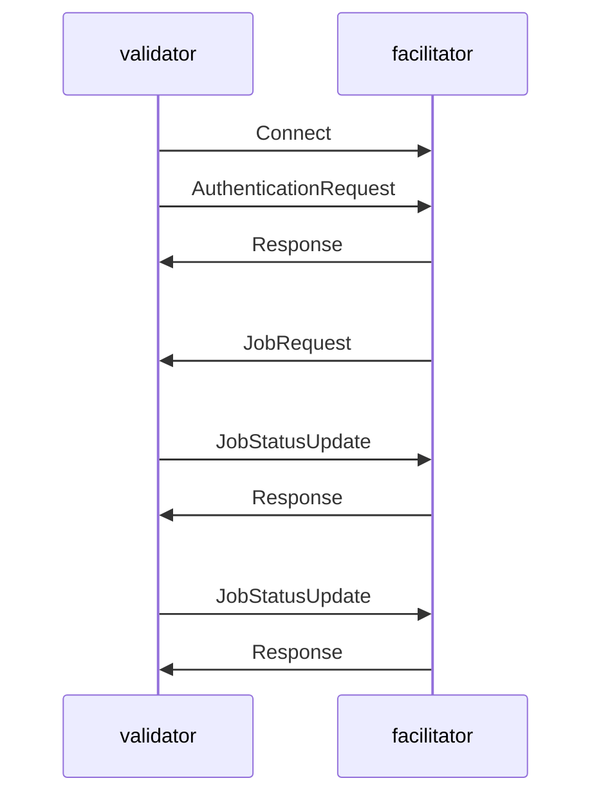

# ComputeHorde facilitator

ComputeHorde app facilitating interaction between end users and Validators.

## WS communication

* connect to ws at `/ws/v0/`
* send `AuthenticationRequest` once (and wait for `Response`)
* wait for incoming `JobRequest` (no need to reply)
* send `JobStatusUpdate` when there is new info about some specific job (and wait for `Response`)

> Multiple connections may be authenticated, each of them will receive same new jobs.



## Important setup step

When setting up output S3 bucket, it is recommended to delete old files regularly. See [AWS documentation on lifecycle configuration](https://docs.aws.amazon.com/AmazonS3/latest/userguide/how-to-set-lifecycle-configuration-intro.html) for more details.

Same for R2: [Configure a bucket’s lifecycle policy](https://developers.cloudflare.com/r2/buckets/object-lifecycles/#configure-a-buckets-lifecycle-policy).

- - -

Skeleton of this project was generated with `cookiecutter-rt-django`, which sometimes gets upgrades that are easy to retrofit into already older projects.

# Base requirements

- docker
- docker-compose
- python 3.11
- [pdm](https://pdm-project.org)
- [nox](https://nox.thea.codes)

# Setup development environment

```sh
# 1st tab
$ ./setup-dev.sh
```

```sh
# 2nd tab
docker-compose up
```

```sh
# 1st tab
cd app/src
pdm run manage.py wait_for_database --timeout 10
pdm run manage.py migrate
pdm run manage.py runserver
```

# Setup production environment (git deployment)

This sets up "deployment by pushing to git storage on remote", so that:

- `git push origin ...` just pushes code to Github / other storage without any consequences;
- `git push production master` pushes code to a remote server running the app and triggers a git hook to redeploy the application.

```
Local .git ------------> Origin .git
                \
                 ------> Production .git (redeploy on push)
```

- - -

Use `ssh-keygen` to generate a key pair for the server, then add read-only access to repository in "deployment keys" section (`ssh -A` is easy to use, but not safe).

```sh
# remote server
mkdir -p ~/repos
cd ~/repos
git init --bare --initial-branch=master computehorde-facilitator.git

mkdir -p ~/domains/computehorde-facilitator
```

```sh
# locally
git remote add production root@<server>:~/repos/computehorde-facilitator.git
git push production master
```

```sh
# remote server
cd ~/repos/computehorde-facilitator.git

cat <<'EOT' > hooks/post-receive
#!/bin/bash
unset GIT_INDEX_FILE
export ROOT=/root
export REPO=computehorde-facilitator
while read oldrev newrev ref
do
    if [[ $ref =~ .*/master$ ]]; then
        export GIT_DIR="$ROOT/repos/$REPO.git/"
        export GIT_WORK_TREE="$ROOT/domains/$REPO/"
        git checkout -f master
        cd $GIT_WORK_TREE
        ./deploy.sh
    else
        echo "Doing nothing: only the master branch may be deployed on this server."
    fi
done
EOT

chmod +x hooks/post-receive
./hooks/post-receive
cd ~/domains/computehorde-facilitator
./setup-prod.sh

# adjust the `.env` file

mkdir letsencrypt
./letsencrypt_setup.sh
./deploy.sh
```

### Deploy another branch

Only `master` branch is used to redeploy an application.
If one wants to deploy other branch, force may be used to push desired branch to remote's `master`:

```sh
git push --force production local-branch-to-deploy:master
```

# AWS

Initiate the infrastructure with Terraform:
TODO

To push a new version of the application to AWS, just push to a branch named `deploy-$(ENVIRONMENT_NAME)`.
Typical values for `$(ENVIRONMENT_NAME)` are `prod` and `staging`.
For this to work, GitHub actions needs to be provided with credentials for an account that has the following policies enabled:

- AutoScalingFullAccess
- AmazonEC2ContainerRegistryFullAccess
- AmazonS3FullAccess

See `.github/workflows/cd.yml` to find out the secret names.

# Vultr

Initiate the infrastructure with Terraform and cloud-init:

- see Terraform template in `<project>/devops/vultr_tf/core/`
- see scripts for interacting with Vultr API in `<project>/devops/vultr_scripts/`
  - note these scripts need `vultr-cli` installed

- for more details see README_vultr.md

# Setting up periodic backups

Add to crontab:

```sh
# crontab -e
30 0 * * * cd ~/domains/computehorde-facilitator && ./bin/backup-db.sh > ~/backup.log 2>&1
```

Set `BACKUP_LOCAL_ROTATE_KEEP_LAST` to keep only a specific number of most recent backups in local `.backups` directory.

## Configuring offsite targets for backups

Backups are put in `.backups` directory locally, additionally then can be stored offsite in following ways:

**Backblaze**

Set in `.env` file:

- `BACKUP_B2_BUCKET_NAME`
- `BACKUP_B2_KEY_ID`
- `BACKUP_B2_KEY_SECRET`

**Email**

Set in `.env` file:

- `EMAIL_HOST`
- `EMAIL_PORT`
- `EMAIL_HOST_USER`
- `EMAIL_HOST_PASSWORD`
- `EMAIL_TARGET`

# Restoring system from backup after a catastrophical failure

1. Follow the instructions above to set up a new production environment
2. Restore the database using bin/restore-db.sh
3. See if everything works
4. Set up backups on the new machine
5. Make sure everything is filled up in .env, error reporting integration, email accounts etc
